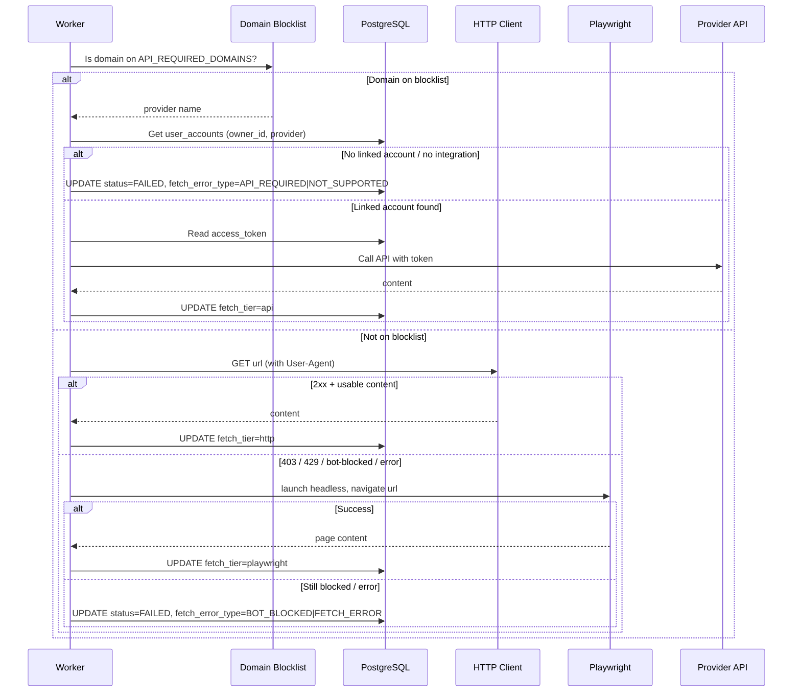

# Design: Resource Fetching Strategy

**Extends:** `docs/technical-design.md` §5.1 (Resource creation event flow), §6.1 (Sequence diagram), §8.2 (Worker checklist)

This document specifies how the resource worker fetches content from URLs. It replaces the simpler "try unauthenticated, fallback to linked account" description previously inline in `technical-design.md` §5.1.1.

---

## 1. Overview

URL fetching uses a tiered strategy. Tiers are tried in order; the first success proceeds to LLM processing.

```
URL submitted
  │
  ├─ Domain on API blocklist?
  │     YES → Tier 1: Official API fetch (uses linked account)
  │     NO  → Tier 2a: Direct HTTP fetch
  │               │
  │               └─ Bot-blocked (403 / 429 / detection)?
  │                     YES → Tier 2b: Playwright headless fetch
  │
  └─ All tiers failed → Classify error, set status=FAILED
```

The tier that succeeded is recorded on the resource (`fetch_tier`). If all tiers fail, the error type is recorded (`fetch_error_type`) and a user-facing message is stored in `status_message`.

---

## 2. Tier 1 — API-Integrated Domains (Blocklist)

Some domains cannot be meaningfully fetched without official API credentials (e.g. Twitter/X renders no useful content publicly). These are pre-classified and bypass the HTTP/Playwright path entirely.

### 2.1 Domain Blocklist

The blocklist is config-driven (environment variable or config file: `API_REQUIRED_DOMAINS`).

| Domain | Provider | Integration Status |
|--------|----------|--------------------|
| `twitter.com` | `twitter` | Implemented |
| `x.com` | `twitter` | Implemented |

Additional domains are added incrementally as official API integrations are implemented (e.g. YouTube, Instagram, LinkedIn).

### 2.2 Fetch Logic (Tier 1)

1. Match the resource URL domain against `API_REQUIRED_DOMAINS`.
2. Resolve provider name from the domain map (e.g. `twitter.com` → `twitter`).
3. Check if the resource owner has a linked account for that provider: look up `user_accounts` by `(owner_id, provider)`.
4. If linked account found:
   - Load the `access_token` (decrypt; refresh via `refresh_token` if expired).
   - Call the provider's official API to retrieve content (e.g. Twitter API for tweet text).
   - On success: record `fetch_tier = api`, proceed to LLM.
5. If no linked account:
   - Set `status = FAILED`, `fetch_error_type = API_REQUIRED`.
   - Set `status_message` to: _"This link requires a linked [Provider] account. Go to Settings to link your account."_
   - Stop; no LLM call.
6. If the domain is on the blocklist but no integration exists yet:
   - Set `status = FAILED`, `fetch_error_type = NOT_SUPPORTED`.
   - Set `status_message` to: _"Fetching content from [domain] is not yet supported."_
   - Stop.

---

## 3. Tier 2 — General HTTP with Playwright Fallback

For all URLs not on the API blocklist.

### 3.1 Tier 2a — Direct HTTP Fetch

1. Issue a standard HTTP GET with a browser-like `User-Agent` header.
2. On success (2xx, usable content): record `fetch_tier = http`, proceed to LLM.
3. On bot-blocking signal (see §3.3 below): fall through to Tier 2b.
4. On other network errors (DNS failure, timeout, connection refused): fall through to Tier 2b.

### 3.2 Tier 2b — Playwright Headless Browser Fetch

1. Launch a headless Chromium browser via Playwright.
2. Navigate to the URL; wait for page load (network idle or configurable timeout).
3. Extract page text content (e.g. `document.body.innerText` or full HTML).
4. On success: record `fetch_tier = playwright`, proceed to LLM.
5. On failure (render error, timeout, still blocked): classify error (see §4).

### 3.3 Bot-Blocking Detection

A response is considered bot-blocked if any of the following are true:
- HTTP status is `403 Forbidden` or `429 Too Many Requests`
- Response body contains known bot-detection fingerprints: Cloudflare challenge page, reCAPTCHA, "access denied", "enable JavaScript" gating pages
- Response content is empty or below a minimum useful length threshold (configurable, e.g. < 200 characters)

---

## 4. Error Classification

If all applicable tiers fail, `status = FAILED` is set with one of the following `fetch_error_type` values:

| Error Type | Condition | User-facing message |
|------------|-----------|---------------------|
| `API_REQUIRED` | Domain on blocklist; user has no linked account | "This link requires a linked [Provider] account. Go to Settings to link your account." |
| `NOT_SUPPORTED` | Domain on blocklist; no API integration exists yet | "Fetching content from [domain] is not yet supported." |
| `BOT_BLOCKED` | Tier 2a and 2b both failed due to bot detection | "This page blocked automated access. Try pasting the content manually." |
| `FETCH_ERROR` | Network error (timeout, DNS, connection refused) on both tiers | "Could not reach this URL. Check the link and try again." |

The `status_message` field on the resource stores the user-facing message. The `fetch_error_type` field stores the machine-readable code.

---

## 5. Data Model Additions

Two new fields are added to the `resources` table (see `docs/technical-design.md` §2.1.3):

| Column | Type | Nullable | Description |
|--------|------|----------|-------------|
| `fetch_tier` | `VARCHAR(20)` | YES | Which tier succeeded: `http`, `playwright`, `api`. NULL until fetch completes. |
| `fetch_error_type` | `VARCHAR(30)` | YES | Error class if fetch failed. NULL if fetch succeeded or resource is text. |

Both fields are NULL for `content_type = text` resources (no fetch needed).

---

## 6. Updated Event Flow

Replaces `docs/technical-design.md` §5.1.1.

```
Worker receives process_resource(resource_id)
  │
  ├─ content_type = text → skip fetch, use original_content
  │
  └─ content_type = url
        │
        ├─ Domain on API_REQUIRED_DOMAINS?
        │     YES: provider = domain map[domain]
        │          integration exists?
        │            NO  → FAILED (NOT_SUPPORTED)
        │          linked account for (owner_id, provider)?
        │            NO  → FAILED (API_REQUIRED)
        │            YES → call provider API
        │                  OK  → fetch_tier = api
        │                  ERR → FAILED (FETCH_ERROR)
        │
        └─ NO: HTTP GET (Tier 2a)
                 OK (2xx, usable content) → fetch_tier = http
                 BOT / ERROR:
                   Playwright (Tier 2b)
                     OK  → fetch_tier = playwright
                     BOT → FAILED (BOT_BLOCKED)
                     ERR → FAILED (FETCH_ERROR)

Continue (fetch succeeded):
  → LLM: title + summary + top_level_categories + tags
  → UPDATE resources (title, summary, tags, top_level_categories, fetch_tier, status=READY)
  → UPDATE Neo4j: merge Category/Tag nodes, edges
```

---

## 7. Updated Sequence Diagram

Replaces the worker fetch branch in `docs/technical-design.md` §6.1.



---

## 8. Implementation Guidance

### 8.1 Domain Blocklist Config

```
API_REQUIRED_DOMAINS=twitter.com:twitter,x.com:twitter
```

Format: `domain:provider` comma-separated pairs. The worker parses this at startup into a dict: `{"twitter.com": "twitter", "x.com": "twitter"}`.

### 8.2 HTTP Fetch

Use `httpx` (async). Set `User-Agent` to a common browser string. Follow redirects. Timeout: 15s. Check response content length and status code for bot-blocking signals before deciding to fall back to Playwright.

### 8.3 Playwright Worker Image

Playwright requires Chromium binaries. This is a **separate Docker build target** from the standard API/worker image.

```dockerfile
# Dockerfile.worker-playwright
FROM mcr.microsoft.com/playwright/python:v1.x.x-jammy
COPY . .
RUN uv pip install -r requirements.txt
```

In Kubernetes, the Playwright-capable worker runs as a separate Deployment (`worker-playwright`) with its own image. The standard worker (`worker`) handles non-Playwright jobs. Jobs are routed to the correct worker queue based on whether Playwright is needed (determined after Tier 2a fails).

Alternatively, for simplicity in early development, a single worker image can include Playwright and try both tiers sequentially. Split into separate deployments when scaling is needed.

### 8.4 `prefer_provider` Interaction

The `prefer_provider` field on a resource provides a hint but is secondary to the domain blocklist. Resolution order:
1. Check domain blocklist (authoritative)
2. Fall back to `prefer_provider` if domain is not on blocklist but user provided a hint
3. Default to Tier 2 if neither matches
