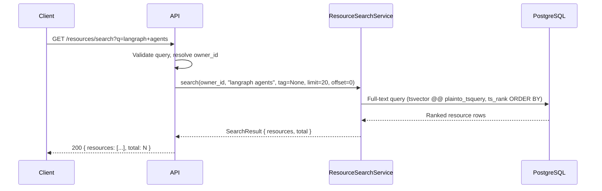
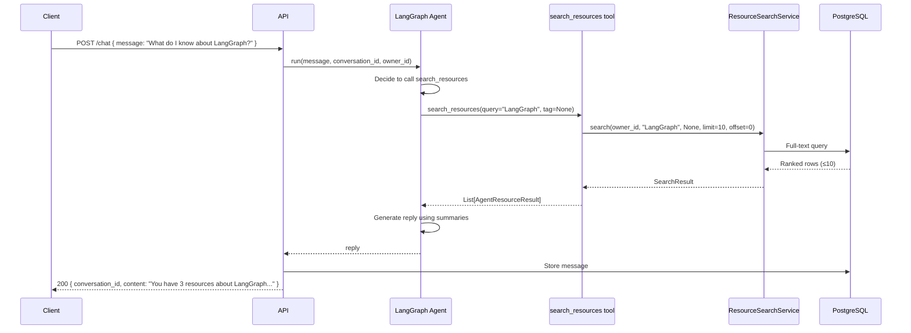
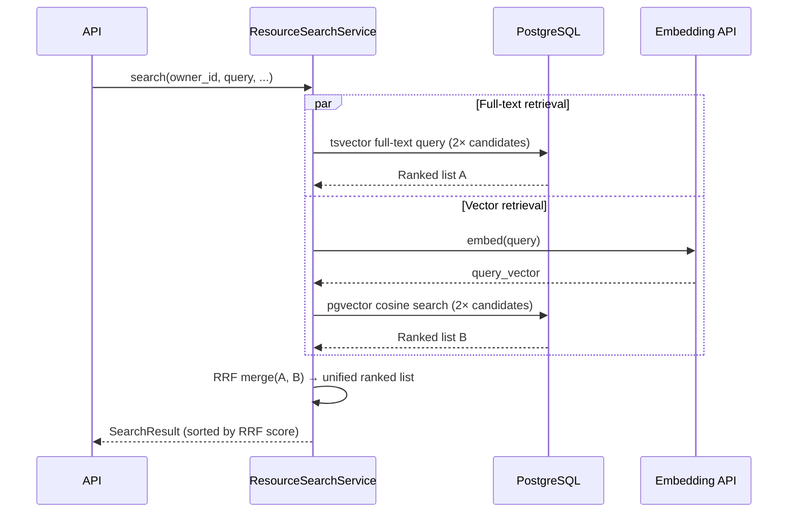

# Search Design — Learning Space

Specifies the unified search capability that serves both user-facing keyword search and the AI agent's retrieval tool. Full specification: data models, service interface, API endpoint, agent tool contract, and phased implementation strategy.

---

## Table of Contents

1. [Overview](#1-overview)
2. [Unified Search Service](#2-unified-search-service)
3. [Output Shapes](#3-output-shapes)
4. [Phase 1 — PostgreSQL Full-Text Search](#4-phase-1--postgresql-full-text-search)
5. [Phase 2 — Hybrid Retrieval (Full-Text + Vector)](#5-phase-2--hybrid-retrieval-full-text--vector)
6. [HTTP API Endpoint](#6-http-api-endpoint)
7. [Agent Tool Contract](#7-agent-tool-contract)
8. [Event Flow](#8-event-flow)
9. [Sequence Diagram](#9-sequence-diagram)
10. [Appendix — Retrieval Strategy Comparison](#10-appendix--retrieval-strategy-comparison)

---

## 1. Overview

Search serves two distinct consumers that share the same underlying retrieval logic:

| Consumer | Entry point | Query origin | Result shape | Limit |
|---|---|---|---|---|
| **User-facing search** | `GET /resources/search` | Human keyword input | Full `ResourceResponse` | Paginated (default 20) |
| **AI agent tool** | `search_resources()` LangGraph tool | Agent-generated natural language | Trimmed `AgentResourceResult` | Fixed at 10 |

**Design principle:** the HTTP endpoint and the agent tool are both thin wrappers around a single `ResourceSearchService`. All retrieval logic lives in the service. Swapping the retrieval strategy (Phase 1 → Phase 2) only changes the service internals — endpoint and tool contracts are stable.

---

## 2. Unified Search Service

### 2.1 Interface

```python
class ResourceSearchService:
    async def search(
        self,
        owner_id: UUID,
        query: str,
        tag: Optional[str] = None,
        limit: int = 20,
        offset: int = 0,
    ) -> SearchResult:
        """
        Search the current user's resources.

        Args:
            owner_id:  The authenticated user's ID. Results are always scoped to this user.
            query:     One or more keywords (natural language). Required and non-empty.
            tag:       Optional tag filter. Narrows results to resources with this exact tag.
            limit:     Max results to return. HTTP callers use default 20. Agent callers cap at 10.
            offset:    Pagination offset. Agent callers always use 0.

        Returns:
            SearchResult with ranked resource list and total count.
        """
```

### 2.2 SearchResult

```python
@dataclass
class SearchResult:
    resources: List[ResourceSearchItem]  # ranked, most relevant first
    total: int                           # total matching count (for pagination)
```

### 2.3 ResourceSearchItem

Internal model. Both output shapes (§3) are derived from this.

```python
@dataclass
class ResourceSearchItem:
    id: UUID
    title: Optional[str]
    summary: Optional[str]
    tags: List[str]
    top_level_categories: List[str]
    original_content: str   # URL or pasted text
    content_type: str       # "url" | "text"
    status: str             # always "READY" (only READY resources are searchable)
    created_at: datetime
    updated_at: datetime
    rank: float             # relevance score (ts_rank in Phase 1; RRF score in Phase 2)
```

**Scope rule:** only resources with `status = 'READY'` are included in search results. Resources still processing or failed are excluded.

---

## 3. Output Shapes

### 3.1 Full response — HTTP endpoint

Used by `GET /resources/search`. Same fields as the existing `ResourceResponse` schema plus `rank` for transparency.

```json
{
  "resources": [
    {
      "id": "550e8400-e29b-41d4-a716-446655440000",
      "owner_id": "7c9e6679-7425-40de-944b-e07fc1f90ae7",
      "content_type": "url",
      "original_content": "https://example.com/langraph-agents",
      "title": "Building AI Agents with LangGraph",
      "summary": "A guide to building stateful multi-step AI agents using LangGraph.",
      "tags": ["LangGraph", "AI Agents", "LLM Tools"],
      "top_level_categories": ["Science & Technology"],
      "status": "READY",
      "status_message": null,
      "rank": 0.842,
      "created_at": "2026-03-14T10:00:00Z",
      "updated_at": "2026-03-14T10:01:00Z"
    }
  ],
  "total": 5
}
```

| Field | Notes |
|---|---|
| `rank` | Relevance score. `ts_rank` float in Phase 1; RRF score float in Phase 2. |
| `total` | Total matching count (may be larger than `resources` array when paginated). |
| All other fields | Same as `ResourceResponse` (see `technical-design.md` §3.1.3). |

### 3.2 Trimmed result — Agent tool

Used by `search_resources()`. Strips fields irrelevant to agent reasoning (status, timestamps, fetch metadata). Keeps only what the agent needs to construct an answer.

```python
@dataclass
class AgentResourceResult:
    id: str                          # resource UUID as string
    title: str                       # LLM-generated title
    summary: str                     # LLM-generated summary
    tags: List[str]                  # tag list
    top_level_categories: List[str]  # category list
    url: Optional[str]               # original_content if content_type == "url"; None for text resources
```

```json
[
  {
    "id": "550e8400-e29b-41d4-a716-446655440000",
    "title": "Building AI Agents with LangGraph",
    "summary": "A guide to building stateful multi-step AI agents using LangGraph.",
    "tags": ["LangGraph", "AI Agents", "LLM Tools"],
    "top_level_categories": ["Science & Technology"],
    "url": "https://example.com/langraph-agents"
  }
]
```

---

## 4. Phase 1 — PostgreSQL Full-Text Search

### 4.1 Data Model: Search Index

Add a functional GIN index to the existing `resources` table. **No new column required.**

```sql
-- Alembic migration: add_resources_search_index
CREATE INDEX CONCURRENTLY resources_search_idx
ON resources
USING GIN (
    to_tsvector(
        'english',
        COALESCE(title, '') || ' ' ||
        COALESCE(summary, '') || ' ' ||
        COALESCE(tags::text, '[]')
    )
);
```

Notes:
- `tags` is JSONB (`["AI", "Python"]`). Cast to `text` produces the JSON string; the `tsvector` parser strips punctuation and extracts individual tokens (`ai`, `python`). This is slightly impure but functionally correct for all practical tag values.
- `CREATE INDEX CONCURRENTLY` avoids table lock in production.
- Index covers `title`, `summary`, and all tag strings.
- `top_level_categories` (e.g. `"Science & Technology"`) are not included in the search vector — they are filter candidates, not search targets. Tag-level specificity is the right retrieval granularity.

### 4.2 Query Logic

```sql
SELECT
    r.*,
    ts_rank(
        to_tsvector('english', COALESCE(r.title,'') || ' ' || COALESCE(r.summary,'') || ' ' || COALESCE(r.tags::text,'[]')),
        plainto_tsquery('english', :query)
    ) AS rank
FROM resources r
WHERE
    r.owner_id = :owner_id
    AND r.status = 'READY'
    AND to_tsvector('english', COALESCE(r.title,'') || ' ' || COALESCE(r.summary,'') || ' ' || COALESCE(r.tags::text,'[]'))
        @@ plainto_tsquery('english', :query)
    AND (:tag IS NULL OR r.tags ? :tag)
ORDER BY rank DESC
LIMIT :limit OFFSET :offset;
```

| Clause | Purpose |
|---|---|
| `plainto_tsquery` | Parses multi-word query naturally ("AI coding tools" → `ai & coding & tools`). Handles stop words, stemming. No special syntax required from user. |
| `@@` | Matches documents containing all query tokens. |
| `ts_rank` | Scores by term frequency and position weighting. Most relevant results first. |
| `tags ? :tag` | PostgreSQL JSONB "contains key" operator — exact tag match for optional filter. |

### 4.3 SQLAlchemy (Python) Implementation

```python
from sqlalchemy import text

async def _full_text_search(
    self,
    session: AsyncSession,
    owner_id: UUID,
    query: str,
    tag: Optional[str],
    limit: int,
    offset: int,
) -> tuple[List[ResourceSearchItem], int]:
    search_expr = """
        to_tsvector('english',
            COALESCE(title,'') || ' ' ||
            COALESCE(summary,'') || ' ' ||
            COALESCE(tags::text,'[]')
        )
    """
    sql = text(f"""
        SELECT *, ts_rank({search_expr}, plainto_tsquery('english', :query)) AS rank,
               COUNT(*) OVER() AS total_count
        FROM resources
        WHERE owner_id = :owner_id
          AND status = 'READY'
          AND {search_expr} @@ plainto_tsquery('english', :query)
          AND (:tag IS NULL OR tags ? :tag)
        ORDER BY rank DESC
        LIMIT :limit OFFSET :offset
    """)
    result = await session.execute(sql, {
        "query": query,
        "owner_id": str(owner_id),
        "tag": tag,
        "limit": limit,
        "offset": offset,
    })
    rows = result.fetchall()
    total = rows[0].total_count if rows else 0
    items = [ResourceSearchItem.from_row(r) for r in rows]
    return items, total
```

### 4.4 Phase 1 Limitations

| Limitation | Impact | Phase 2 resolution |
|---|---|---|
| No synonym matching | "async" won't match "non-blocking" | Vector embeddings handle semantic equivalence |
| No typo tolerance | "langraph" won't match "LangGraph" | Mitigated by `plainto_tsquery` stemming for common cases; `pg_trgm` or vector closes the gap |
| Exact-token requirement | Query must share vocabulary with document | Vector embeddings close this gap entirely |

---

## 5. Phase 2 — Hybrid Retrieval (Full-Text + Vector)

Phase 2 layers semantic (dense) retrieval on top of Phase 1's keyword (sparse) retrieval. Combined with RRF, this handles both exact queries and conceptual/paraphrase queries.

### 5.1 Embedding Storage

New table: `resource_embeddings`

| Column | Type | Constraints | Description |
|---|---|---|---|
| `resource_id` | UUID | PK, FK(resources.id) ON DELETE CASCADE | One embedding per resource |
| `embedding` | vector(1536) | NOT NULL | Dense embedding vector |
| `model` | VARCHAR(100) | NOT NULL | Embedding model name (e.g. `text-embedding-3-small`) |
| `created_at` | TIMESTAMPTZ | NOT NULL, default now() | |
| `updated_at` | TIMESTAMPTZ | NOT NULL, default now() | |

```sql
-- Requires pgvector extension (pre-enabled on Supabase)
CREATE EXTENSION IF NOT EXISTS vector;

CREATE TABLE resource_embeddings (
    resource_id UUID PRIMARY KEY REFERENCES resources(id) ON DELETE CASCADE,
    embedding   vector(1536) NOT NULL,
    model       VARCHAR(100) NOT NULL,
    created_at  TIMESTAMPTZ NOT NULL DEFAULT now(),
    updated_at  TIMESTAMPTZ NOT NULL DEFAULT now()
);

-- IVFFlat index for approximate nearest-neighbor search
-- lists = sqrt(expected_row_count); start with 100 for up to 10k resources
CREATE INDEX resource_embeddings_vec_idx
    ON resource_embeddings
    USING ivfflat (embedding vector_cosine_ops)
    WITH (lists = 100);
```

**Supabase note:** pgvector is natively available on all Supabase PostgreSQL instances. No additional configuration required.

### 5.2 Embedding Text

The text embedded for each resource:

```python
def build_embedding_text(resource: Resource) -> str:
    """Concatenate searchable fields for embedding generation."""
    parts = []
    if resource.title:
        parts.append(resource.title)
    if resource.summary:
        parts.append(resource.summary)
    if resource.tags:
        parts.append(" ".join(resource.tags))
    if resource.top_level_categories:
        parts.append(" ".join(resource.top_level_categories))
    return " ".join(parts)
```

### 5.3 Vector Search Query

```sql
SELECT r.*, 1 - (re.embedding <=> :query_embedding::vector) AS similarity
FROM resources r
JOIN resource_embeddings re ON re.resource_id = r.id
WHERE r.owner_id = :owner_id
  AND r.status = 'READY'
  AND (:tag IS NULL OR r.tags ? :tag)
ORDER BY re.embedding <=> :query_embedding::vector  -- cosine distance (lower = more similar)
LIMIT :limit;
```

`<=>` is the pgvector cosine distance operator. Sort ascending (nearest neighbor). The similarity score is `1 - distance` (higher = more similar).

### 5.4 Hybrid Merge — Reciprocal Rank Fusion (RRF)

RRF merges ranked lists from different retrieval systems without needing to normalize their scores. Formula:

```
RRF_score(d) = Σ  1 / (k + rank_i(d))
               i
```

where `k = 60` (empirically validated constant), and `rank_i(d)` is document `d`'s rank in retrieval system `i` (1-indexed).

```python
async def _hybrid_search(
    self,
    session: AsyncSession,
    owner_id: UUID,
    query: str,
    tag: Optional[str],
    limit: int,
    offset: int,
) -> tuple[List[ResourceSearchItem], int]:
    k = 60  # RRF constant

    # Fetch candidate lists in parallel (2× limit to allow merging)
    candidates = limit * 2
    full_text, _ = await self._full_text_search(session, owner_id, query, tag, candidates, 0)
    query_embedding = await self._embed(query)
    vector, _ = await self._vector_search(session, owner_id, query_embedding, tag, candidates)

    # Build RRF score map
    scores: dict[UUID, float] = {}
    all_items: dict[UUID, ResourceSearchItem] = {}

    for rank, item in enumerate(full_text):
        scores[item.id] = scores.get(item.id, 0.0) + 1.0 / (k + rank + 1)
        all_items[item.id] = item

    for rank, item in enumerate(vector):
        scores[item.id] = scores.get(item.id, 0.0) + 1.0 / (k + rank + 1)
        all_items[item.id] = item

    # Sort by combined RRF score
    sorted_ids = sorted(scores.keys(), key=lambda id_: scores[id_], reverse=True)
    total = len(sorted_ids)
    page_ids = sorted_ids[offset : offset + limit]

    result = []
    for id_ in page_ids:
        item = all_items[id_]
        item.rank = scores[id_]
        result.append(item)

    return result, total
```

### 5.5 Worker Pipeline Addition (Phase 2)

After the existing LLM step, add embedding generation:

```
Existing worker flow:
  fetch → LLM (title, summary, tags, categories) → DB update → Neo4j graph update

Phase 2 addition (step between LLM and Neo4j):
  fetch → LLM → DB update → [generate embedding → upsert resource_embeddings] → Neo4j graph update
```

```python
# In process_resource job, after DB update
embedding_text = build_embedding_text(resource)
embedding_vector = await embedding_client.embed(embedding_text)
await upsert_resource_embedding(session, resource.id, embedding_vector, model="text-embedding-3-small")
```

On re-processing (PATCH with new content), the `resource_embeddings` row must be updated alongside the resource. The FK `ON DELETE CASCADE` handles deletion automatically.

### 5.6 Embedding Model

| Model | Dimensions | Cost (per 1M tokens) | Quality |
|---|---|---|---|
| `text-embedding-3-small` | 1536 | ~$0.02 | Good — recommended default |
| `text-embedding-3-large` | 3072 | ~$0.13 | Better for long documents |
| Self-hosted (e.g. `nomic-embed-text`) | 768 | Free (compute cost) | Comparable to 3-small |

**Recommended:** `text-embedding-3-small`. Median resource (title + summary + ~10 tags) is ~200 tokens. At 10,000 resources, total embedding cost ≈ $0.04. The same provider used for LLM processing can supply embeddings — no additional vendor required if using OpenAI-compatible providers (Groq, Fireworks, etc. do not offer embeddings; OpenAI or a self-hosted model is needed for Phase 2).

**Environment variable:** `EMBEDDING_MODEL` (default `text-embedding-3-small`), `EMBEDDING_API_KEY`.

---

## 6. HTTP API Endpoint

### 6.1 Definition

```
GET /api/v1/resources/search
```

Auth: Required. Results are scoped to the authenticated user.

### 6.2 Query Parameters

| Parameter | Type | Required | Default | Description |
|---|---|---|---|---|
| `q` | string | Yes | — | Search query. 1–500 characters. Multi-word supported. |
| `tag` | string | No | null | Exact tag filter. Narrows results to resources containing this tag. |
| `limit` | integer | No | 20 | Max results. Min 1, max 100. |
| `offset` | integer | No | 0 | Pagination offset. |

### 6.3 Response (200 OK)

```json
{
  "resources": [ ...ResourceResponse objects with rank field... ],
  "total": 12
}
```

### 6.4 Error Responses

| Status | Code | Condition |
|---|---|---|
| 400 | `SEARCH_QUERY_EMPTY` | `q` is empty string or whitespace only |
| 400 | `SEARCH_QUERY_TOO_LONG` | `q` exceeds 500 characters |
| 401 | (standard) | Not authenticated |
| 422 | (standard FastAPI) | `limit` or `offset` out of range |

### 6.5 Pydantic Schemas

```python
class ResourceSearchRequest(BaseModel):
    q: str = Query(..., min_length=1, max_length=500, strip_whitespace=True)
    tag: Optional[str] = Query(default=None)
    limit: int = Query(default=20, ge=1, le=100)
    offset: int = Query(default=0, ge=0)

class ResourceSearchResponse(BaseModel):
    resources: List[ResourceResponse]  # existing schema + rank field
    total: int
```

### 6.6 Example

```http
GET /api/v1/resources/search?q=langraph+agents&limit=5 HTTP/1.1
Authorization: Bearer <token>
```

```json
{
  "resources": [
    {
      "id": "550e8400-e29b-41d4-a716-446655440000",
      "title": "Building AI Agents with LangGraph",
      "summary": "A guide to building stateful multi-step AI agents using LangGraph.",
      "tags": ["LangGraph", "AI Agents", "LLM Tools"],
      "top_level_categories": ["Science & Technology"],
      "status": "READY",
      "rank": 0.842,
      ...
    }
  ],
  "total": 3
}
```

---

## 7. Agent Tool Contract

### 7.1 Tool Definition

```python
@tool
async def search_resources(
    query: str,
    tag: Optional[str] = None,
) -> List[dict]:
    """
    Search the user's learning resources by keyword or concept.

    Use this tool when the user asks about specific topics, technologies, or
    concepts in their library. Supports natural language queries — you do not
    need to use exact tag names.

    Args:
        query: A keyword or natural language description of what to find.
               Examples: "LangGraph", "async Python", "machine learning basics"
        tag:   Optional. An exact tag to filter by in addition to the query.
               Use only when the user explicitly references a tag.

    Returns:
        List of matching resources (up to 10), each with id, title, summary,
        tags, top_level_categories, and url (null for text resources).
    """
    results = await resource_search_service.search(
        owner_id=current_user.id,
        query=query,
        tag=tag,
        limit=10,   # cap for agent context efficiency
        offset=0,   # no pagination in agent context
    )
    return [AgentResourceResult.from_item(r).dict() for r in results.resources]
```

### 7.2 Tool Constraints

| Constraint | Value | Rationale |
|---|---|---|
| `limit` | 10 (hard cap) | Agent context is finite; more than 10 results rarely improve agent output quality |
| `offset` | Always 0 | Agents do not paginate; if top 10 are insufficient, query should be refined |
| Auth scope | `current_user.id` from agent invocation context | Agent can only access the current user's resources |
| Retry on empty | Encouraged in system prompt | If no results, agent should try a broader query before reporting nothing found |

### 7.3 Agent System Prompt Addition

```
When searching for resources, prefer broader queries over narrow ones — you can
always filter results by asking follow-up questions. If search_resources returns
an empty list, try a single-keyword version of the query before reporting no results.
```

---

## 8. Event Flow

### 8.1 User Search Flow (Phase 1)

1. User types query in the search bar; frontend calls `GET /resources/search?q=<query>`.
2. API validates query (non-empty, ≤500 chars), resolves `owner_id` from session.
3. API calls `ResourceSearchService.search(owner_id, query, tag, limit, offset)`.
4. Service executes PostgreSQL full-text query; returns ranked `SearchResult`.
5. API serializes to `ResourceSearchResponse` and returns 200.
6. Frontend renders results in ranked order, replacing resource list view.

### 8.2 Agent Search Flow (Phase 1)

1. User sends chat message (e.g. "What do I know about async Python?").
2. LangGraph agent reasons and invokes `search_resources("async Python")`.
3. Tool calls `ResourceSearchService.search(owner_id, "async Python", tag=None, limit=10, offset=0)`.
4. Service executes the same PostgreSQL query; returns top 10 results.
5. Tool returns `List[AgentResourceResult]` to agent context.
6. Agent generates reply using the resource summaries.

### 8.3 Worker Embedding Flow (Phase 2 only)

1. Worker finishes LLM step; resource `title`, `summary`, `tags` are now set.
2. Worker calls `build_embedding_text(resource)` to construct the text to embed.
3. Worker calls embedding API (`text-embedding-3-small`) with the text.
4. Worker upserts embedding vector into `resource_embeddings` table.
5. On re-processing: worker updates the `resource_embeddings` row.
6. On deletion: cascade `ON DELETE CASCADE` removes the embedding automatically.

---

## 9. Sequence Diagram

### 9.1 User Search (Phase 1)



### 9.2 Agent Search (Phase 1)



### 9.3 Hybrid Search (Phase 2)



---

## 10. Appendix — Retrieval Strategy Comparison

This table documents the analysis that drove the phased approach.

### 10.1 Keyword Match (Exact / Lexical)

| Property | Detail |
|---|---|
| **How it works** | Tokenizes query and documents; matches on shared tokens. PostgreSQL: `tsvector` + `ts_rank`. |
| **Multi-keyword** | ✅ Natural. `plainto_tsquery` generates `token1 & token2 & ...` |
| **Stemming** | ✅ "running" matches "run", "runner". Configurable by language dictionary. |
| **Synonyms** | ❌ "async" does not match "non-blocking" |
| **Typo tolerance** | Partial. Stemming helps ("langraph" → miss; "langgraph" → miss). `pg_trgm` can add this. |
| **Ranking** | `ts_rank` (term frequency + position). Reasonable but not semantic. |
| **Infrastructure** | None — uses existing PostgreSQL |
| **Latency** | ~1–5 ms for personal library scale |
| **Cost** | None |
| **Best for** | Tag names, proper nouns, technology names, exact concept queries |
| **Phase** | Phase 1 |

### 10.2 Semantic / Vector Search (Dense Retrieval)

| Property | Detail |
|---|---|
| **How it works** | Embeds documents + query as vectors; finds nearest neighbors by cosine similarity. pgvector in PostgreSQL. |
| **Multi-keyword** | ✅ Natural. Embedding encodes full semantic context. |
| **Stemming** | ✅ Implicit — embedding model handles morphology. |
| **Synonyms** | ✅ "async" and "non-blocking" land near each other in vector space. |
| **Typo tolerance** | Partial. Embedding models tolerate common typos. |
| **Ranking** | Cosine similarity. Semantically superior to `ts_rank`. |
| **Infrastructure** | pgvector extension (pre-enabled on Supabase; free). Embedding API (OpenAI or self-hosted). |
| **Latency** | ~5–20 ms query + embedding API call (~50–150 ms). Can cache query embeddings. |
| **Cost** | ~$0.02 / 1M tokens for `text-embedding-3-small`. Personal library: < $0.01 total. |
| **Best for** | Conceptual queries, paraphrase matching, "what do I know about X" chat-style questions |
| **Phase** | Phase 2 |

### 10.3 Hybrid (Full-Text + Vector + RRF)

| Property | Detail |
|---|---|
| **How it works** | Both retrievers run in parallel; results merged via RRF. |
| **Multi-keyword** | ✅ Best of both — exact token match + semantic context |
| **Stemming** | ✅ Both retrievers contribute |
| **Synonyms** | ✅ Vector side handles it |
| **Typo tolerance** | Best — vector handles common misspellings; full-text catches exact names |
| **Ranking** | RRF is proven to outperform individual rankers in retrieval benchmarks |
| **Infrastructure** | pgvector (Phase 2) |
| **Latency** | Parallel retrieval; embedding API is the bottleneck (~100–200 ms total) |
| **Cost** | Same as vector search — embedding per query |
| **Best for** | Production AI agents, search bars on knowledge-dense content |
| **Phase** | Phase 2 |

### 10.4 Dedicated Search Engine (Typesense, Meilisearch, Elasticsearch)

| Property | Detail |
|---|---|
| **How it works** | Separate search service with its own index, query language, and ranking. |
| **Multi-keyword** | ✅ |
| **Stemming** | ✅ |
| **Synonyms** | ✅ (configurable synonym dictionaries) |
| **Typo tolerance** | ✅ Built-in fuzzy matching |
| **Ranking** | Excellent — tunable BM25 + custom boosting |
| **Infrastructure** | New managed service or self-hosted container. Data sync pipeline required. |
| **Latency** | < 10 ms |
| **Cost** | Managed: $25–100+/month. Self-hosted: compute cost. |
| **Best for** | High query volume, multi-tenant search, complex query DSL requirements |
| **Recommended?** | Not at this stage. Adds operational surface area (sync pipeline, new vendor) without meaningful benefit at personal library scale. Revisit if multi-tenancy or high query volume becomes a requirement. |

### 10.5 File System / grep

| Property | Detail |
|---|---|
| **How it works** | Pattern-matching over files on disk. |
| **Best for** | Code search, static documents, CI tools (e.g. Claude Code's Grep tool) |
| **Application data** | ❌ Not applicable. User resources live in PostgreSQL, not files. |
| **Recommended?** | No. Wrong abstraction layer for dynamic application data. |

### 10.6 Decision Summary

```
Phase 1 (this sprint):  PostgreSQL full-text (tsvector)
  → Covers keyword search, multi-keyword, stemming
  → Zero new infrastructure
  → Handles 90%+ of practical queries at personal library scale

Phase 2 (follow-up sprint):  Add pgvector + hybrid RRF
  → Adds semantic matching for natural language agent queries
  → No new vendor — Supabase ships pgvector
  → Unlocks "what do I know about X" chat quality improvement
  → Implement by extending ResourceSearchService internals only;
    endpoint and agent tool contracts unchanged

Future (if scale demands):  Add dedicated search engine (Typesense/Meilisearch)
  → Only warranted at high query volume or multi-tenant scale
  → Log as TD task; do not implement proactively
```
