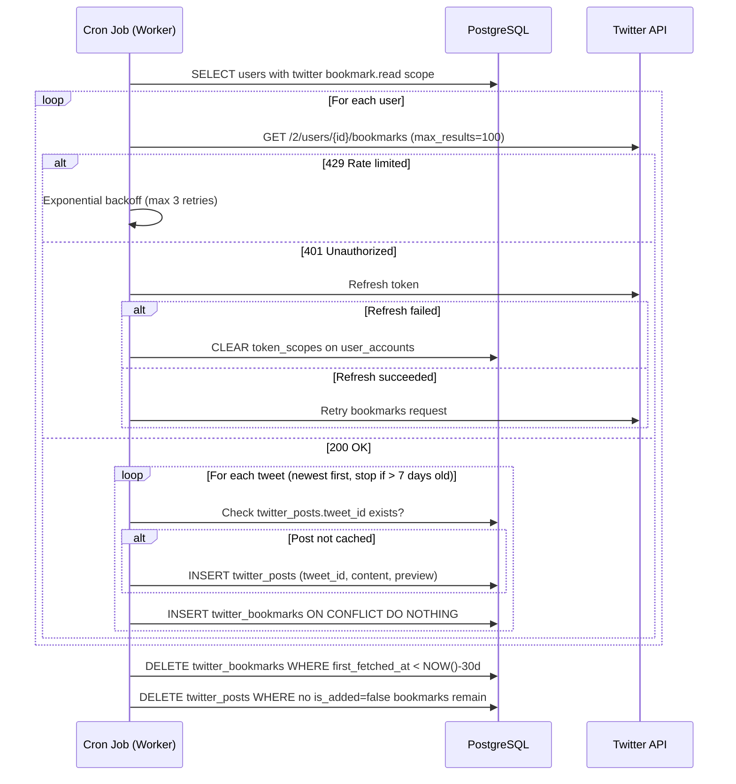
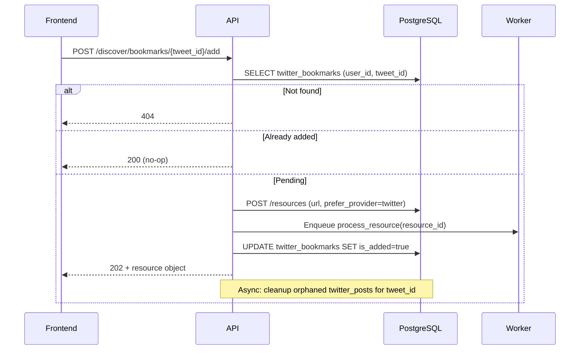

# Design: X.com (Twitter) Integration

**Extends:** `docs/technical-design.md` §2.1.6–2.1.7 (Data Model), §4.7–4.8 (Endpoints), `docs/requirements.md` §8

This document is the full specification for X.com (Twitter) integration. It covers OAuth scope management, the `twitter_posts` / `twitter_bookmarks` data model, the bookmark sync cron job, API contracts, cleanup logic, and rate limit handling.

---

## 1. Overview

The integration has three concerns:

1. **OAuth permission grant** — extend the existing Twitter login token with `bookmark.read` scope.
2. **Bookmark sync** — a background cron job fetches the user's recent X.com bookmarks and stores them in the Discover queue.
3. **Discover API** — serves the queue to the frontend; supports quick-add to Learning Space via the existing resource creation flow.

---

## 2. OAuth Scope Management

### 2.1 Required Scopes

| Scope            | Purpose                                      |
| ---------------- | -------------------------------------------- |
| `tweet.read`     | Read tweet/Article content                   |
| `users.read`     | Read author profile info                     |
| `bookmark.read`  | Read the authenticated user's bookmarks      |
| `offline.access` | Obtain refresh tokens for long-lived access  |

### 2.2 Incremental Authorization Flow

A user may already have Twitter linked for login with only basic scopes (`tweet.read users.read`). The bookmark feature requires re-authorization to add `bookmark.read`.

```
User → Settings → Integrations → X.com

  Case A: Not connected
    → [ Connect X.com ] → POST /integrations/twitter/authorize
    → redirect_url returned → frontend redirects user to Twitter
    → Twitter OAuth callback → /auth/callback?state=twitter_bookmark_auth:<user_id>
    → API exchanges code for tokens (all 4 scopes)
    → UPDATE user_accounts SET access_token, refresh_token, token_scopes
    → redirect back to Settings

  Case B: Connected, bookmark.read missing
    → [ Grant Bookmark Access ] → same POST /integrations/twitter/authorize flow
    → replaces existing access_token and token_scopes on the same user_accounts row

  Case C: Fully connected
    → No action needed; status shown
```

### 2.3 `token_scopes` tracking

`user_accounts.token_scopes` is a space-separated string updated on every successful OAuth grant or token refresh. Helper used across the codebase:

```python
def has_scope(account: UserAccount, scope: str) -> bool:
    return scope in (account.token_scopes or "").split()
```

---

## 3. Data Model

See `docs/technical-design.md` §2.1.6 (`twitter_posts`) and §2.1.7 (`twitter_bookmarks`) for the full column definitions.

### 3.1 Key design decisions

- **`twitter_posts` is global** — one row per tweet/Article, shared across all users. The cron job checks for existence before fetching from the API, eliminating redundant API calls when multiple users bookmark the same post.
- **`twitter_bookmarks` is per-user** — tracks the relationship between a user and a post, including whether it has been added to Learning Space (`is_added`).
- **`first_fetched_at` on `twitter_bookmarks`** — records when the cron job first discovered this bookmark for this user. Used exclusively for the 30-day TTL cleanup. Distinct from `twitter_posts.fetched_at` (when post content was fetched from the API).

---

## 4. Cleanup Logic

Cleanup runs at the end of every cron pass:

```sql
-- Step 1: Remove stale bookmark records (30-day TTL)
DELETE FROM twitter_bookmarks
WHERE first_fetched_at < NOW() - INTERVAL '30 days';

-- Step 2: Remove posts with no remaining discovery value
-- Handles both: orphaned posts (no bookmarks) and fully-added posts
-- (all referencing bookmarks have is_added=true)
DELETE FROM twitter_posts tp
WHERE NOT EXISTS (
    SELECT 1 FROM twitter_bookmarks tb
    WHERE tb.tweet_id = tp.tweet_id AND tb.is_added = false
);
```

Step 2 is safe to run after Step 1 — stale bookmarks are already gone, so any post they exclusively referenced becomes orphaned and is caught by Step 2.

---

## 5. Cron Job: `twitter_bookmark_sync`

### 5.1 Schedule

- Every hour: `cron("0 * * * *")`
- Immediately on worker process startup (runs once before entering the cron loop)

### 5.2 Algorithm

```python
def twitter_bookmark_sync():
    users = db.query("""
        SELECT DISTINCT u.id FROM users u
        JOIN user_accounts ua ON ua.user_id = u.id
        WHERE ua.provider = 'twitter'
          AND ua.token_scopes LIKE '%bookmark.read%'
    """)

    for user in users:
        sync_bookmarks_for_user(user.id)

    run_cleanup()


def sync_bookmarks_for_user(user_id: UUID):
    account = get_twitter_account(user_id)  # load + decrypt access_token; refresh if needed
    cutoff = NOW() - timedelta(days=7)
    pagination_token = None

    while True:
        response = twitter_api_get_bookmarks(
            user_external_id=account.external_id,
            access_token=account.access_token,
            max_results=100,
            pagination_token=pagination_token,
            tweet_fields="id,text,created_at,author_id",
            expansions="author_id,attachments.media_keys",
            # Article fields (requires Basic+ tier):
            article_fields="title,body",
        )

        if response.status == 429:
            handle_rate_limit(user_id)  # exponential backoff: 1m → 2m → 4m, max 3 retries
            return  # skip this user this cycle

        if response.status == 401:
            refreshed = attempt_token_refresh(account)
            if not refreshed:
                clear_token_scopes(account)  # user must re-authorize
                return
            # retry once with new token (handled by caller)

        for tweet in response.data:
            if tweet.created_at < cutoff:
                return  # tweets are newest-first; stop pagination

            # Cache post content if not already stored
            if not db.exists("twitter_posts", tweet_id=tweet.id):
                preview_text = extract_preview(tweet)
                db.insert("twitter_posts", {
                    "tweet_id": tweet.id,
                    "tweet_url": f"https://x.com/{tweet.author.username}/status/{tweet.id}",
                    "author_name": tweet.author.name,
                    "author_username": tweet.author.username,
                    "title": tweet.article.title if tweet.article else None,
                    "preview_text": preview_text,
                    "posted_at": tweet.created_at,
                })

            # Record bookmark for this user (idempotent)
            db.insert("twitter_bookmarks", {
                "user_id": user_id,
                "tweet_id": tweet.id,
                "bookmarked_at": tweet.bookmarked_at,
            }, on_conflict="(user_id, tweet_id) DO NOTHING")

        if response.meta.next_token and response.data[-1].created_at > cutoff:
            pagination_token = response.meta.next_token
        else:
            break


def extract_preview(tweet) -> str:
    if tweet.article and tweet.article.body:
        # Long-form Article — truncate to first 200 words
        words = tweet.article.body.split()
        if len(words) > 200:
            return " ".join(words[:200]) + "..."
        return tweet.article.body
    else:
        # Standard tweet (≤280 chars) — use full text
        return tweet.text
```

### 5.3 Rate limit handling

| Scenario     | Action |
| ------------ | ------ |
| HTTP 429     | Exponential backoff: wait 1 min, 2 min, 4 min (max 3 retries); if all fail, skip user for this cycle and log warning |
| HTTP 401     | Attempt token refresh; if refresh fails, clear `token_scopes` and skip; user must re-authorize in Settings |
| Other errors | Log error, skip user for this cycle; do not abort the full sync |

**Scale note**: Twitter Basic tier allows ~180 bookmark requests / 15 min per user. With `max_results=100`, most users need 1–2 pages per cycle, well within limits. At ~150 simultaneous active users, consider staggering job start times across the hour window.

---

## 6. API Contracts

### 6.1 GET /integrations/twitter/status

**Response (200)**:
```json
{
  "connected": true,
  "has_bookmark_scope": true,
  "granted_scopes": "tweet.read users.read bookmark.read offline.access",
  "account": {
    "display_name": "John Doe",
    "username": "@johndoe"
  },
  "last_synced_at": "2026-03-30T10:00:00Z",
  "pending_bookmark_count": 12
}
```

| Field                   | Type            | Description |
| ----------------------- | --------------- | ----------- |
| `connected`             | boolean         | True if any Twitter `user_accounts` row exists |
| `has_bookmark_scope`    | boolean         | True if `token_scopes` includes `bookmark.read` |
| `granted_scopes`        | string \| null  | Full scope string; null if not connected |
| `account`               | object \| null  | `{ display_name, username }` from `user_accounts` |
| `last_synced_at`        | ISO8601 \| null | Timestamp of last successful cron run for this user |
| `pending_bookmark_count`| integer         | Count of `twitter_bookmarks` where `is_added=false` |

### 6.2 POST /integrations/twitter/authorize

**Response (200)**:
```json
{ "redirect_url": "https://twitter.com/i/oauth2/authorize?client_id=...&scope=tweet.read+users.read+bookmark.read+offline.access&..." }
```

Frontend performs a full-page redirect to `redirect_url`. The OAuth callback uses `state=twitter_bookmark_auth:<user_id>` to distinguish from the standard login flow. On callback success, `user_accounts.access_token`, `refresh_token`, and `token_scopes` are updated.

### 6.3 DELETE /integrations/twitter/disconnect

**Behavior**:
1. Clears `token_scopes` on the `user_accounts` row.
2. If the Twitter account was NOT the user's login account (i.e. user has another linked account) → delete the `user_accounts` row entirely.
3. If it IS the user's only or primary login account → keep the row but clear scopes (user can still log in; bookmark sync is disabled).
4. Deletes all `twitter_bookmarks` rows for this user.

**Response**: 204 No Content.

### 6.4 GET /discover/bookmarks

**Query params**: `limit` (integer, default 20), `offset` (integer, default 0)

**Response (200)**:
```json
{
  "total": 47,
  "limit": 20,
  "offset": 0,
  "items": [
    {
      "tweet_id": "1234567890123456789",
      "tweet_url": "https://x.com/johndoe/status/1234567890123456789",
      "author_name": "John Doe",
      "author_username": "johndoe",
      "title": "How I Scaled My Startup to 10M Users",
      "preview_text": "When we first launched, we had no idea...",
      "posted_at": "2026-03-28T14:30:00Z",
      "bookmarked_at": "2026-03-29T09:15:00Z"
    }
  ]
}
```

`title` is null for standard tweets; `preview_text` contains the full tweet text in that case.

### 6.5 POST /discover/bookmarks/{tweet_id}/add

**Behavior**:
1. Look up `twitter_bookmarks` for `(current_user_id, tweet_id)` → 404 if not found.
2. If `is_added=true` → return 200 (idempotent no-op).
3. Create resource: `POST /resources` with `content_type=url`, `original_content=tweet_url`, `prefer_provider=twitter`.
4. On success: set `twitter_bookmarks.is_added=true`.
5. Return 202 with the created resource object.
6. Async (after response): run Step 2 of cleanup query for this `tweet_id`.

**Error responses**:

| Code | Scenario |
| ---- | -------- |
| 401  | Not authenticated |
| 404  | `tweet_id` not in user's bookmarks |
| 200  | Already added (idempotent) |
| 422  | Resource creation failed (e.g. token expired); `detail` contains user-facing message |

---

## 7. Sequence Diagram — Bookmark Sync



---

## 8. Sequence Diagram — Quick-Add from Discover


