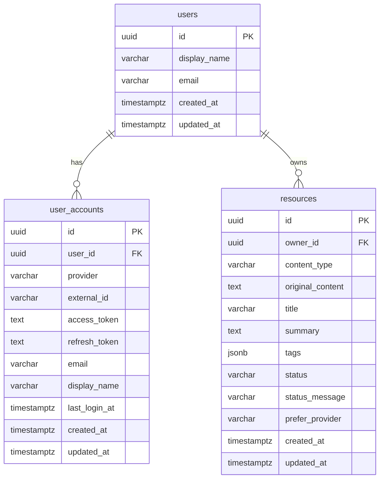
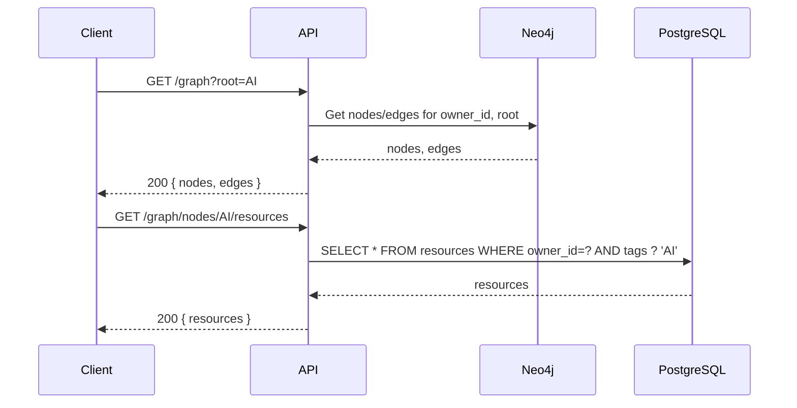
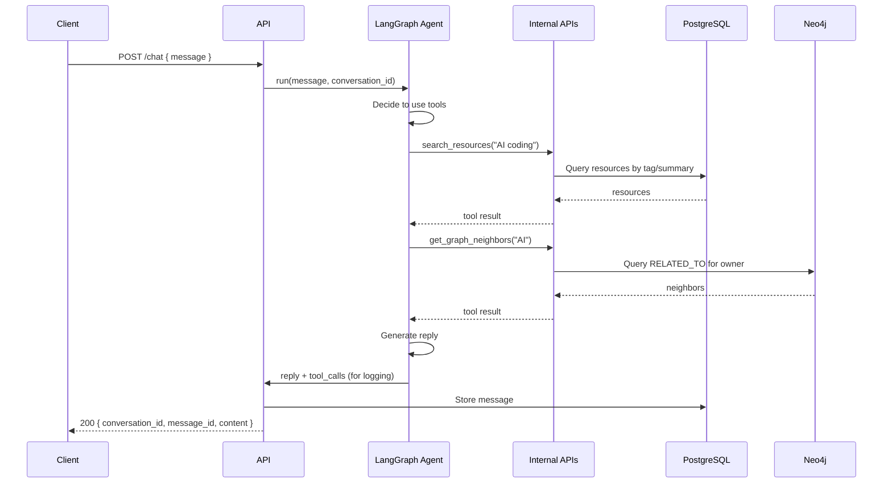
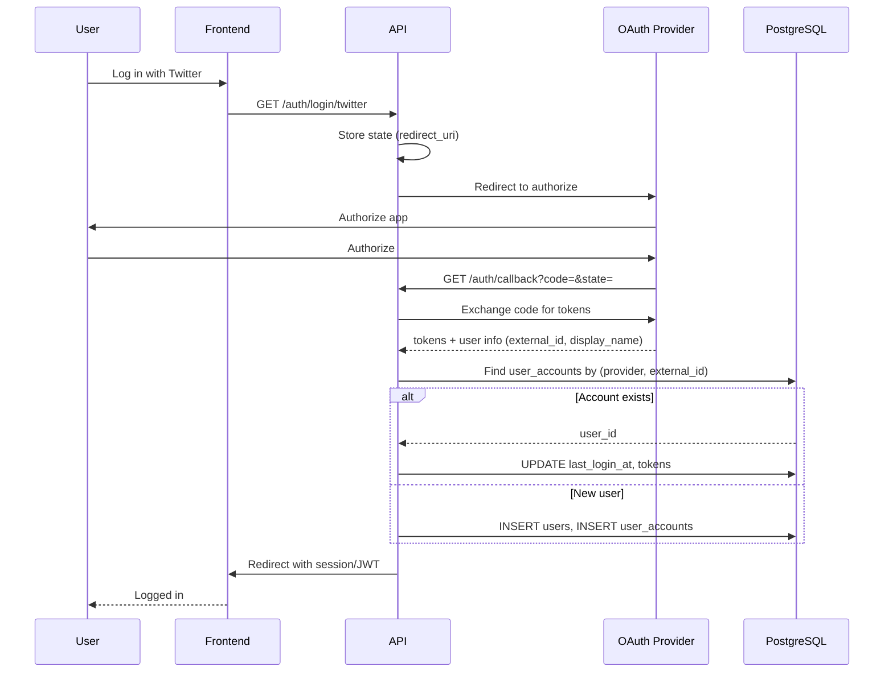
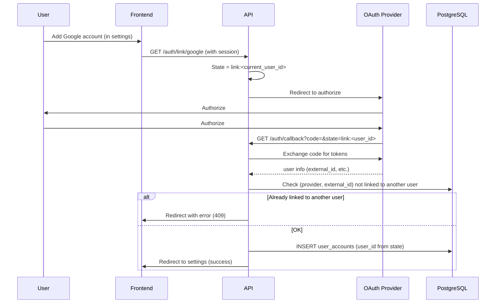
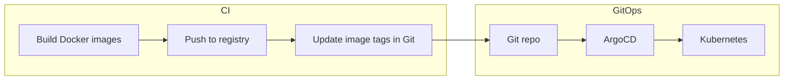

# Technical Design: Learning Space App

This document provides a technical design for the Learning Space application, derived from [Product Requirements](requirements.md). It is intended for implementers and AI coding agents.

---

## Table of Contents

1. [System Overview](#1-system-overview)
2. [Data Models](#2-data-models)
3. [API Schemas](#3-api-schemas)
4. [Example Endpoints](#4-example-endpoints)
5. [Event Flows](#5-event-flows)
6. [Sequence Diagrams](#6-sequence-diagrams)
7. [Deployment Strategy](#7-deployment-strategy)
8. [Implementation Guidance for AI Agents](#8-implementation-guidance-for-ai-agents)

---

## 1. System Overview

### 1.1 Architecture Summary

| Layer               | Technology                                          | Responsibility                                                                   |
| ------------------- | --------------------------------------------------- | -------------------------------------------------------------------------------- |
| **UI**              | Next.js, graph lib (e.g. React Flow / Cytoscape.js) | Resource submission, browsing, graph viz, chatbot                                |
| **API**             | FastAPI                                             | Request routing, auth, rate limiting                                             |
| **Resource Update** | Python (async workers)                              | Create/update/delete resources, LLM summarization, tag extraction, graph updates |
| **Resource Viewer** | Python service                                      | Read resources, search by tag, graph traversal APIs                              |
| **AI Agent**        | LangGraph, LangSmith                                | Chat, tool use (search, graph, summarization)                                    |
| **Data**            | PostgreSQL, Neo4j                                   | Users/resources/metadata; knowledge graph                                        |

### 1.2 Data Store Responsibilities

- **PostgreSQL**: Users, resources, metadata, processing status.
- **Neo4j**: Knowledge graph (nodes = tags/topics, edges = co-occurrence / shared resources).

---

## 2. Data Models

### 2.1 PostgreSQL (Relational)

#### 2.1.1 `users`

Represents a single person. Identity is aggregated from one or more linked social accounts.

| Column         | Type         | Constraints                   | Description                                                            |
| -------------- | ------------ | ----------------------------- | ---------------------------------------------------------------------- |
| `id`           | UUID         | PK, default gen_random_uuid() | User ID                                                                |
| `display_name` | VARCHAR(255) |                               | Preferred display name (optional; can be derived from linked accounts) |
| `email`        | VARCHAR(255) |                               | Preferred email (optional; can be derived from linked accounts)        |
| `created_at`   | TIMESTAMPTZ  | NOT NULL, default now()       |                                                                        |
| `updated_at`   | TIMESTAMPTZ  | NOT NULL, default now()       |                                                                        |

#### 2.1.2 `user_accounts`

One row per linked social (OAuth) account. A user can have multiple accounts (e.g. Twitter + Google + GitHub). Login with any linked account authenticates as the same user.

| Column          | Type         | Constraints                   | Description                                                                                                                                               |
| --------------- | ------------ | ----------------------------- | --------------------------------------------------------------------------------------------------------------------------------------------------------- |
| `id`            | UUID         | PK, default gen_random_uuid() | Account ID                                                                                                                                                |
| `user_id`       | UUID         | FK(users.id), NOT NULL        | Owner user                                                                                                                                                |
| `provider`      | VARCHAR(50)  | NOT NULL                      | e.g. `twitter`, `google`, `github`                                                                                                                        |
| `external_id`   | VARCHAR(255) | NOT NULL                      | Provider's subject (e.g. Twitter user ID)                                                                                                                 |
| `access_token`  | TEXT         |                               | Encrypted; used for provider API calls and for **fetching URL content** when a resource URL is from that provider and requires login (e.g. Twitter post). |
| `refresh_token` | TEXT         |                               | If provider supports refresh                                                                                                                              |
| `email`         | VARCHAR(255) |                               | Email from provider (if available)                                                                                                                        |
| `display_name`  | VARCHAR(255) |                               | Display name from provider                                                                                                                                |
| `last_login_at` | TIMESTAMPTZ  |                               | Last time this account was used to log in                                                                                                                 |
| `created_at`    | TIMESTAMPTZ  | NOT NULL, default now()       |                                                                                                                                                           |
| `updated_at`    | TIMESTAMPTZ  | NOT NULL, default now()       |                                                                                                                                                           |

**Unique constraint**: `(provider, external_id)` — a given social account can be linked to at most one user.

**Indexes**: `user_id`, `(provider, external_id)` (unique).

#### 2.1.3 `resources`

| Column             | Type         | Constraints                   | Description                                                                                                                                                     |
| ------------------ | ------------ | ----------------------------- | --------------------------------------------------------------------------------------------------------------------------------------------------------------- |
| `id`               | UUID         | PK, default gen_random_uuid() | Resource ID                                                                                                                                                     |
| `owner_id`         | UUID         | FK(users.id), NOT NULL        | Owner user                                                                                                                                                      |
| `content_type`     | VARCHAR(20)  | NOT NULL                      | `url` or `text`                                                                                                                                                 |
| `original_content` | TEXT         | NOT NULL                      | URL string or pasted text                                                                                                                                       |
| `title`            | VARCHAR(500) |                               | LLM-generated or derived title                                                                                                                                  |
| `summary`          | TEXT         |                               | LLM-generated summary                                                                                                                                           |
| `tags`             | JSONB        | default '[]'                  | Array of tag strings from LLM                                                                                                                                   |
| `status`           | VARCHAR(20)  | NOT NULL, default 'PENDING'   | `PENDING`, `PROCESSING`, `READY`, `FAILED`                                                                                                                      |
| `status_message`   | VARCHAR(500) |                               | Optional error or progress message (e.g. "Link your Twitter account in Settings to save content from this site.")                                               |
| `prefer_provider`        | VARCHAR(50)  |                               | Optional. Hint for which linked account to use. Authoritative resolution uses the domain blocklist; see `docs/design-resource-fetching.md`. |
| `fetch_tier`             | VARCHAR(20)  |                               | Which fetch tier succeeded: `http`, `playwright`, `api`. NULL for text resources or before fetch completes. |
| `fetch_error_type`       | VARCHAR(30)  |                               | Error class if fetch failed: `API_REQUIRED`, `NOT_SUPPORTED`, `BOT_BLOCKED`, `FETCH_ERROR`. NULL if fetch succeeded. |
| `top_level_categories`   | JSONB        | NOT NULL, default '[]'        | Array of top-level category names assigned by LLM or user. Min 1 entry after processing. See `docs/design-category-taxonomy.md`. |
| `created_at`             | TIMESTAMPTZ  | NOT NULL, default now()       |                                                                                                                                                                 |
| `updated_at`             | TIMESTAMPTZ  | NOT NULL, default now()       |                                                                                                                                                                 |

**Indexes**: `owner_id`, `status`, `created_at`, GIN on `tags` for search, GIN on `top_level_categories` for filtering.

#### 2.1.4 `resource_processing_log` (optional, for observability)

| Column        | Type        | Constraints      | Description                                                                           |
| ------------- | ----------- | ---------------- | ------------------------------------------------------------------------------------- |
| `id`          | UUID        | PK               |                                                                                       |
| `resource_id` | UUID        | FK(resources.id) |                                                                                       |
| `event`       | VARCHAR(50) |                  | e.g. `queued`, `fetch_started`, `llm_started`, `graph_updated`, `completed`, `failed` |
| `payload`     | JSONB       |                  | Event-specific data                                                                   |
| `created_at`  | TIMESTAMPTZ | NOT NULL         |                                                                                       |

#### 2.1.5 `categories`

Stores system-seeded and user-created top-level categories. Full specification: `docs/design-category-taxonomy.md`.

| Column | Type | Constraints | Description |
| -------------- | ------------ | --------------------------------- | --------------------------------------------- |
| `id` | UUID | PK, default gen_random_uuid() | Category ID |
| `user_id` | UUID | FK(users.id), nullable | NULL = system-seeded; non-null = user-created |
| `name` | VARCHAR(255) | NOT NULL | Display name |
| `is_system` | BOOLEAN | NOT NULL, default false | True for the 10 seeded categories |
| `created_at` | TIMESTAMPTZ | NOT NULL, default now() | |

**Unique constraints**: `(user_id, LOWER(name))` per user; partial unique index on `LOWER(name) WHERE user_id IS NULL` for system categories.

---

### 2.2 Neo4j (Knowledge Graph)

Full specification: `docs/design-category-taxonomy.md` §4.

#### 2.2.1 Node: `Root`

- **Label**: `Root`
- **Properties**: `owner_id` (UUID string), `name` (“My Learning Space”)
- One per user. Created on first graph interaction.

#### 2.2.2 Node: `Category`

- **Label**: `Category`
- **Properties**: `id` (category name), `owner_id` (UUID string), `is_system` (boolean)
- One node per category per user. System categories are merged for each user on first graph interaction.

#### 2.2.3 Node: `Tag`

- **Label**: `Tag`
- **Properties**:
  - `id`: string (unique tag name, e.g. `”AI”`, `”Coding Agents”`)
  - `owner_id`: string (UUID of user; used for multi-tenancy)
  - `created_at`: datetime (optional)

#### 2.2.4 Relationship: `CHILD_OF`

- **Type**: `CHILD_OF`
- **Direction**: `Category → Root`
- No additional properties. Created when category nodes are first merged for a user.

#### 2.2.5 Relationship: `BELONGS_TO`

- **Type**: `BELONGS_TO`
- **Direction**: `Tag → Category`
- **Properties**: `weight` (integer — number of resources linking this tag to this category)
- A tag can belong to multiple categories.

#### 2.2.6 Relationship: `RELATED_TO`

- **Type**: `RELATED_TO`
- **Direction**: Tag → Tag (bidirectional semantics via query)
- **Properties** (optional):
  - `weight`: integer (number of resources that share both tags)
  - `updated_at`: datetime

#### 2.2.7 Resource–Tag linkage

Resolved via PostgreSQL only: query resources where `tags` array contains the tag name, and `top_level_categories` contains the category name. Neo4j is used for graph structure only.

### 2.3 ER Diagram (PostgreSQL)



---

## 3. API Schemas

All request/response bodies are JSON. Use these schemas for validation (e.g. Pydantic) and OpenAPI docs.

### 3.1 Resource

#### 3.1.1 Create resource (request)

```json
{
  "content_type": "url",
  "original_content": "https://example.com/ai-coding-agents"
}
```

Or for pasted text:

```json
{
  "content_type": "text",
  "original_content": "Pasted article or note content here..."
}
```

| Field              | Type   | Required | Description                                                                                                                                                                                             |
| ------------------ | ------ | -------- | ------------------------------------------------------------------------------------------------------------------------------------------------------------------------------------------------------- |
| `content_type`     | string | Yes      | `"url"` or `"text"`                                                                                                                                                                                     |
| `original_content` | string | Yes      | URL or raw text                                                                                                                                                                                         |
| `prefer_provider`  | string | No       | When the URL is from a login-required site (e.g. Twitter), hint which linked account to use: `twitter`, `google`, `github`. If omitted, the worker infers from URL domain (e.g. twitter.com → twitter). |

**Submission requires authentication.** If the client is not logged in, `POST /resources` returns **401 Unauthorized**. The frontend should prompt the user to log in and then retry or redirect to login before allowing resource submission.

#### 3.1.2 Update resource (request)

Only fields that are allowed to be updated by the user (e.g. for manual override).

```json
{
  "title": "Optional user override",
  "original_content": "https://updated-url.com/article",
  "tags": ["Machine Learning", "Python", "Neural Networks"],
  "top_level_categories": ["Science & Technology", "Education & Knowledge"]
}
```

All fields optional; only provided fields are updated. Rules:
- Changing `original_content` triggers re-processing (status → `PROCESSING`).
- If `top_level_categories` is provided, it must contain at least one valid category name — returns `400 CATEGORY_REQUIRED` otherwise.
- If `top_level_categories` contains unknown category names — returns `400 INVALID_CATEGORY`.
- Updating `tags` or `top_level_categories` enqueues a graph resync job for this resource.

#### 3.1.3 Resource (response)

```json
{
  "id": "550e8400-e29b-41d4-a716-446655440000",
  "owner_id": "7c9e6679-7425-40de-944b-e07fc1f90ae7",
  "content_type": "url",
  "original_content": "https://example.com/ai-coding-agents",
  "title": "How AI Coding Agents Work",
  "summary": "Overview of AI coding agents and how they assist developers.",
  "tags": ["AI", "Coding Agents", "LLM Tools", "Developer Productivity"],
  "status": "READY",
  "status_message": null,
  "created_at": "2025-03-14T10:00:00Z",
  "updated_at": "2025-03-14T10:01:00Z"
}
```

### 3.2 Knowledge Graph

#### 3.2.1 Graph node (for API response)

```json
{
  "id": "Science & Technology",
  "label": "Science & Technology",
  "node_type": "category",
  "level": "current",
  "resource_count": 12
}
```

| Field            | Type    | Description                                                              |
| ---------------- | ------- | ------------------------------------------------------------------------ |
| `id`             | string  | Node name (unique per user)                                              |
| `label`          | string  | Display label (same as id)                                               |
| `node_type`      | string  | `root` \| `category` \| `topic`                                          |
| `level`          | string  | `parent` \| `current` \| `child`                                         |
| `resource_count` | integer | Number of resources with this tag/category (0 for root and category nodes if no resources yet) |

#### 3.2.2 Graph edge

```json
{
  "source": "AI",
  "target": "Coding Agents",
  "weight": 3
}
```

#### 3.2.3 Graph view (response)

```json
{
  "nodes": [
    { "id": "AI", "label": "AI", "level": "parent", "resource_count": 5 },
    {
      "id": "Coding Agents",
      "label": "Coding Agents",
      "level": "current",
      "resource_count": 3
    },
    {
      "id": "Developer Tools",
      "label": "Developer Tools",
      "level": "child",
      "resource_count": 2
    }
  ],
  "edges": [
    { "source": "AI", "target": "Coding Agents", "weight": 3 },
    { "source": "Coding Agents", "target": "Developer Tools", "weight": 2 }
  ]
}
```

#### 3.2.4 Expand node (request)

Query params or body to request “next level” centered on a node:

- `node_id`: string (tag name)
- `direction`: `children` (default) or `parents` (optional)

### 3.3 Chat

#### 3.3.1 Send message (request)

```json
{
  "message": "What resources do I have about AI coding?",
  "conversation_id": "optional-uuid-for-multi-turn"
}
```

| Field             | Type          | Required | Description                        |
| ----------------- | ------------- | -------- | ---------------------------------- |
| `message`         | string        | Yes      | User message                       |
| `conversation_id` | string (UUID) | No       | If omitted, start new conversation |

#### 3.3.2 Chat message (response)

```json
{
  "conversation_id": "550e8400-e29b-41d4-a716-446655440001",
  "message_id": "660e8400-e29b-41d4-a716-446655440002",
  "role": "assistant",
  "content": "You have 3 resources about AI coding: ...",
  "created_at": "2025-03-14T10:05:00Z"
}
```

### 3.4 Authentication

- **Login**: OAuth 2.0 per provider (Twitter/X, Google, GitHub). Frontend redirects to backend `/auth/login/{provider}`; backend redirects to that provider; callback at `/auth/callback` exchanges code for tokens. Backend looks up `user_accounts` by `(provider, external_id)`. If found, the user is logged in; if not, a new `users` row and `user_accounts` row are created (first-time sign-up).
- **Multiple accounts per user**: A user can link additional providers from settings. They start the link flow (e.g. `GET /auth/link/{provider}`) while already authenticated; at callback, a new `user_accounts` row is created with the current `user_id`. The same `(provider, external_id)` cannot be linked to a different user.
- **Session**: Use HTTP-only cookie or Bearer JWT. All authenticated endpoints expect the same mechanism (e.g. `Authorization: Bearer <token>` or cookie). The resolved identity is always the **user** (not a specific account).

#### 3.4.1 Current user (response)

Includes the user and all linked social accounts (tokens and sensitive fields are never returned).

```json
{
  "id": "7c9e6679-7425-40de-944b-e07fc1f90ae7",
  "display_name": "johndoe",
  "email": "jane@example.com",
  "accounts": [
    {
      "id": "a1b2c3d4-e5f6-7890-abcd-ef1234567890",
      "provider": "twitter",
      "display_name": "johndoe",
      "email": null,
      "last_login_at": "2025-03-14T10:00:00Z",
      "created_at": "2025-01-01T00:00:00Z"
    },
    {
      "id": "b2c3d4e5-f6a7-8901-bcde-f12345678901",
      "provider": "google",
      "display_name": "Jane Doe",
      "email": "jane@example.com",
      "last_login_at": "2025-03-13T15:30:00Z",
      "created_at": "2025-02-01T00:00:00Z"
    }
  ]
}
```

| Field          | Type           | Description                                                   |
| -------------- | -------------- | ------------------------------------------------------------- |
| `id`           | string (UUID)  | User ID                                                       |
| `display_name` | string         | User-level display name (e.g. from primary account or merged) |
| `email`        | string \| null | User-level email if available from any account                |
| `accounts`     | array          | List of linked social accounts (no tokens)                    |

#### 3.4.2 Linked account (response, within current user)

| Field           | Type                     | Description                   |
| --------------- | ------------------------ | ----------------------------- |
| `id`            | string (UUID)            | Account ID (use for unlink)   |
| `provider`      | string                   | `twitter`, `google`, `github` |
| `display_name`  | string \| null           | Display name from provider    |
| `email`         | string \| null           | Email from provider           |
| `last_login_at` | string (ISO8601) \| null | Last login with this account  |
| `created_at`    | string (ISO8601)         | When the account was linked   |

### 3.5 Errors

Standard error body:

```json
{
  "detail": "Human-readable message",
  "code": "RESOURCE_NOT_FOUND",
  "status": 404
}
```

Use HTTP status codes: 400 (validation, or e.g. `CANNOT_UNLINK_LAST_ACCOUNT`), 401 (unauthorized), 403 (forbidden), 404 (not found), 429 (rate limit), 500 (server error).

---

## 4. Example Endpoints

Base path: `/api/v1`. All endpoints except auth and health require authentication.

### 4.1 Health & Auth

| Method | Path                          | Description                                                                                                                | Auth |
| ------ | ----------------------------- | -------------------------------------------------------------------------------------------------------------------------- | ---- |
| GET    | `/health`                     | Liveness/readiness                                                                                                         | No   |
| GET    | `/auth/login/{provider}`      | Redirect to OAuth provider (`twitter`, `google`, `github`). Query: `?redirect_uri=` optional.                              | No   |
| GET    | `/auth/callback`              | OAuth callback. Query: `state` (e.g. `link:<user_id>` for link flow). Creates or finds user/account; returns session/JWT.  | No   |
| GET    | `/auth/link/{provider}`       | Start link flow (must be authenticated). Redirects to provider; callback creates new `user_accounts` row for current user. | Yes  |
| POST   | `/auth/logout`                | Invalidate session                                                                                                         | Yes  |
| GET    | `/auth/me`                    | Current user and linked accounts (see [3.4.1](#341-current-user-response))                                                 | Yes  |
| DELETE | `/auth/accounts/{account_id}` | Unlink a social account. Fails with 400 if it is the user's last account (must keep at least one).                         | Yes  |

### 4.2 Resources

| Method | Path              | Description                                                                                                                                                                               |
| ------ | ----------------- | ----------------------------------------------------------------------------------------------------------------------------------------------------------------------------------------- |
| POST   | `/resources`      | Create resource (body: content_type, original_content, optional prefer_provider). **Requires auth**; returns 401 if not logged in. Returns 202 with resource (status PENDING/PROCESSING). |
| GET    | `/resources`      | List resources for current user. Query: `?status=READY`, `?tag=AI`, `?limit=20`, `?offset=0`.                                                                                             |
| GET    | `/resources/{id}` | Get single resource.                                                                                                                                                                      |
| PATCH  | `/resources/{id}` | Update resource (user-editable fields). If original_content changes, trigger re-processing.                                                                                               |
| DELETE | `/resources/{id}` | Delete resource and update graph asynchronously.                                                                                                                                          |

### 4.3 Categories

| Method | Path | Description |
| ------ | ---- | ----------- |
| GET | `/categories` | List all categories visible to current user (system + user-created). |
| POST | `/categories` | Create a custom category. Body: `{"name": "..."}`. Returns 201. Returns 409 if name conflicts. |
| DELETE | `/categories/{id}` | Delete user-created category. Returns 400 `CATEGORY_IN_USE` if resources reference it. Returns 403 for system categories. |

See full spec: `docs/design-category-taxonomy.md` §6.3.

### 4.4 Knowledge Graph

| Method | Path                               | Description                                                                                                               |
| ------ | ---------------------------------- | ------------------------------------------------------------------------------------------------------------------------- |
| GET    | `/graph`                           | Get graph view (parent / current / child levels). Query: `?root=TagName` (optional; default root = “all” or first level). |
| GET    | `/graph/nodes/{node_id}/resources` | List resources that have the given tag.                                                                                   |
| POST   | `/graph/expand`                    | Expand graph (body or query: `node_id`, optional `direction`). Returns updated nodes/edges for next level.                |

### 4.5 Chat

| Method | Path                                | Description                                                                                             |
| ------ | ----------------------------------- | ------------------------------------------------------------------------------------------------------- |
| POST   | `/chat`                             | Send message (body: message, optional conversation_id). Returns assistant message (streaming optional). |
| GET    | `/chat/conversations`               | List conversations for current user.                                                                    |
| GET    | `/chat/conversations/{id}/messages` | Get messages in a conversation.                                                                         |

### 4.6 Example Request/Response

**POST /api/v1/resources**

Request:

```http
POST /api/v1/resources HTTP/1.1
Host: api.learningspace.example
Authorization: Bearer <token>
Content-Type: application/json

{
  "content_type": "url",
  "original_content": "https://example.com/ai-coding-agents"
}
```

Response (202 Accepted):

```json
{
  "id": "550e8400-e29b-41d4-a716-446655440000",
  "owner_id": "7c9e6679-7425-40de-944b-e07fc1f90ae7",
  "content_type": "url",
  "original_content": "https://example.com/ai-coding-agents",
  "title": null,
  "summary": null,
  "tags": [],
  "status": "PROCESSING",
  "status_message": "Queued for processing",
  "created_at": "2025-03-14T10:00:00Z",
  "updated_at": "2025-03-14T10:00:00Z"
}
```

**GET /api/v1/graph/nodes/AI/resources**

Response (200):

```json
{
  "resources": [
    {
      "id": "550e8400-e29b-41d4-a716-446655440000",
      "title": "How AI Coding Agents Work",
      "summary": "Explanation of how LLM-powered agents generate code.",
      "original_content": "https://example.com/article-1",
      "content_type": "url"
    },
    {
      "id": "550e8400-e29b-41d4-a716-446655440001",
      "title": "Best Tools for AI-Assisted Development",
      "summary": "Overview of tools like Copilot and code assistants.",
      "original_content": "https://example.com/article-2",
      "content_type": "url"
    }
  ]
}
```

---

## 5. Event Flows

### 5.1 Resource creation (async)

1. **User must be logged in.** If the client calls `POST /resources` without a valid session/JWT, the API returns **401 Unauthorized**. The frontend should prompt the user to log in and then allow them to submit the resource again (or redirect to login before showing the add-resource form).
2. Client sends `POST /resources` with `content_type`, `original_content`, and optionally `prefer_provider` (for URL resources that require login on the target site).
3. API creates row in PostgreSQL with `status = PENDING` (or `PROCESSING`), returns 202 and resource.
4. Job is enqueued (e.g. Redis/Celery, or in-process task queue).
5. Worker: **fetch content** — see [5.1.1 Fetching URL content](#511-fetching-url-content). Then call LLM for title/summary/top_level_categories/tags (prompt includes current category list and user's existing tags); update resource row (`title`, `summary`, `tags`, `top_level_categories`, `fetch_tier`, `status = READY` or `FAILED`).
6. Worker: update Neo4j — ensure Root/Category/Tag nodes for this user; create/update `CHILD_OF`, `BELONGS_TO`, and `RELATED_TO` edges; ensure `owner_id` scoping. See `docs/design-category-taxonomy.md` §5.3.
7. Optionally emit `resource.ready` or `resource.failed` for UI (e.g. WebSocket or polling).

#### 5.1.1 Fetching URL content

The worker uses a tiered fetch strategy: domain blocklist (Tier 1: official API), direct HTTP (Tier 2a), Playwright headless browser fallback (Tier 2b). Full specification, event flow, and sequence diagram: `docs/design-resource-fetching.md`.

For **pasted text** (`content_type = text`), no fetch is needed; use `original_content` as-is.

### 5.2 Resource update (re-process)

1. Client sends `PATCH /resources/{id}` with e.g. new `original_content`.
2. API sets `status = PROCESSING`, enqueues same pipeline as creation (fetch → LLM → DB update → graph update).
3. Before graph update, remove old tag associations for this resource from Neo4j, then apply new tags and edges.

### 5.3 Resource deletion

1. Client sends `DELETE /resources/{id}`.
2. API marks resource as deleted (soft delete) or removes row; enqueues “graph sync” job.
3. Worker: in Neo4j, decrement or remove relationships that were backed by this resource; remove or update RELATED_TO weights; delete Tag nodes that have no resources left (optional).

### 5.4 Graph exploration

1. Client requests `GET /graph` or `GET /graph?root=AI`.
2. API (Resource Viewer) queries Neo4j for nodes/edges for current user (owner_id), filtered by root and level (parent/current/child).
3. Response returns nodes and edges; frontend renders and allows “expand” (e.g. POST /graph/expand with node_id).
4. On node click, client calls `GET /graph/nodes/{node_id}/resources`; backend resolves resources from PostgreSQL by tag name and owner_id.

### 5.5 Chat (agent with tools)

1. Client sends `POST /chat` with `message` and optional `conversation_id`.
2. API passes message to LangGraph agent. Agent has tools: e.g. `search_resources(query, tag)`, `get_resources_for_tag(tag)`, `get_graph_neighbors(node_id)`, `get_resource_summary(resource_id)`.
3. Agent may call these tools (via internal service calls or API), then generate reply.
4. Response is stored (conversation_id, message_id, role, content) and returned to client. LangSmith used for tracing.

### 5.6 Login (multi-account)

1. User clicks “Log in with Twitter” (or Google/GitHub). Frontend redirects to `GET /auth/login/twitter`.
2. API stores optional `redirect_uri` in state, redirects to Twitter OAuth authorize URL.
3. User authorizes; provider redirects to `GET /auth/callback?code=...&state=...`.
4. API exchanges code for tokens, fetches provider user info (e.g. `external_id`, `display_name`, `email`).
5. API looks up `user_accounts` by `(provider, external_id)`. If found: set session for that `user_id`, update `last_login_at` and optionally tokens. If not found: create new `users` row and new `user_accounts` row, then set session.
6. API redirects to frontend (e.g. `redirect_uri` from state).

### 5.7 Link account

1. User is already logged in. In settings, they click “Add Google account”.
2. Frontend redirects to `GET /auth/link/google`. API stores in state that this is a link flow (e.g. `state=link:<current_user_id>`) and redirects to Google OAuth.
3. User authorizes; provider redirects to `GET /auth/callback?code=...&state=link:<user_id>`.
4. API exchanges code, gets provider user info. If `(provider, external_id)` already exists for another user, return 409 or error page (account already linked elsewhere). Otherwise create new `user_accounts` row with `user_id` from state.
5. API redirects back to settings with success; `GET /auth/me` will now include the new account.

### 5.8 Unlink account

1. User requests `DELETE /auth/accounts/{account_id}`. API verifies the account belongs to current user and that the user has at least two accounts. If only one account, return 400 with `CANNOT_UNLINK_LAST_ACCOUNT`. Otherwise delete the `user_accounts` row and return 204.

---

## 6. Sequence Diagrams

### 6.1 Resource creation and processing

```mermaid
sequenceDiagram
    participant Client
    participant API
    participant DB as PostgreSQL
    participant Queue
    participant Worker
    participant Target as Target URL / Provider API
    participant LLM
    participant Neo4j

    Client->>API: POST /resources { content_type, original_content }
    alt Not authenticated
        API-->>Client: 401 Unauthorized (frontend prompts login)
    else Authenticated
        API->>DB: INSERT resource (status=PENDING)
        API->>Queue: Enqueue process_resource(resource_id)
        API-->>Client: 202 + resource

        Queue->>Worker: process_resource(resource_id)
        Worker->>DB: UPDATE status=PROCESSING
        alt content_type=url
            Note over Worker,Target: Tiered fetch strategy — see docs/design-resource-fetching.md
            Worker->>Target: Tier 1 (API) or Tier 2a (HTTP) or Tier 2b (Playwright)
            alt Fetch succeeded
                Target-->>Worker: content, fetch_tier recorded
            else All tiers failed
                Worker->>DB: UPDATE status=FAILED, fetch_error_type, status_message
            end
        end
        Worker->>LLM: Summarize + assign top_level_categories + extract tags
        Note over Worker,LLM: Prompt includes current category list + user's existing tags
        LLM-->>Worker: title, summary, top_level_categories, tags
        Worker->>DB: UPDATE resource (title, summary, tags, top_level_categories, fetch_tier, status=READY)
        Worker->>Neo4j: Merge Root/Category/Tag nodes; update CHILD_OF, BELONGS_TO, RELATED_TO edges
        Worker->>DB: Optional: processing_log
    end
```

### 6.2 Knowledge graph update (after resource ready)

See full specification: `docs/design-category-taxonomy.md` §5.3.

```mermaid
sequenceDiagram
    participant Worker
    participant DB as PostgreSQL
    participant Neo4j

    Worker->>DB: Get resource tags + top_level_categories (owner_id, resource_id)
    Worker->>Neo4j: MERGE Root node (owner_id)
    Worker->>Neo4j: MERGE Category nodes for each top_level_category; MERGE CHILD_OF → Root
    Worker->>Neo4j: MERGE Tag nodes for each tag (owner_id)
    loop For each tag × each top_level_category
        Worker->>Neo4j: MERGE (tag)-[BELONGS_TO weight+=1]->(category)
    end
    loop For each pair of tags on the resource
        Worker->>Neo4j: MERGE (t1)-[RELATED_TO weight+=1]-(t2)
    end
    Worker->>Neo4j: Optional: cleanup zero-weight edges
```

### 6.3 Graph exploration and resource list by node



### 6.4 Chat with agent tools



### 6.5 OAuth login (multi-account)



### 6.6 Link account (already logged in)



---

## 7. Deployment Strategy

### 7.1 Build: Docker images

- **Frontend**: Dockerfile for Next.js (e.g. `node` build, then `node:alpine` or standalone output). Serve on port 3000.
- **Backend (API + workers + viewer)**: Single Python image (FastAPI app + worker process) or split:
  - `learning-space-api`: FastAPI (API + Resource Viewer logic).
  - `learning-space-worker`: Same codebase, run as Celery worker or in-process async worker that consumes from queue.
- **AI Agent**: Can run in same backend service (same image) or separate service that calls API/DB/Neo4j; same repo, optional second image `learning-space-agent` if scaled separately.

Recommended minimum: **two images** — `learning-space-frontend`, `learning-space-backend` (API + worker + agent in one process or multiple containers from same image).

### 7.2 Orchestration: Kubernetes + Helm

- **Helm chart** under `deploy/helm/learning-space/` (or similar).
- **Values**: image tags, replicas, env (DB URLs, Neo4j URI, OAuth credentials, LangSmith API key, etc.).
- **Components**:
  - **Deployments**:
    - `frontend`: Next.js app.
    - `api`: FastAPI (and optionally Resource Viewer in same pod).
    - `worker`: Optional separate deployment for async jobs.
    - `agent`: Optional if separated from API.
  - **Services**: ClusterIP for api, agent; LoadBalancer/Ingress for frontend and API (or single Ingress with path-based routing).
  - **Ingress**: TLS, host/path routing to frontend and `/api` to backend.
  - **Secrets**: DB password, Neo4j password, OAuth client secret, LangSmith API key.
  - **ConfigMaps**: Non-sensitive config (e.g. feature flags, log level).
  - **PVC**: Only if needed for local storage; prefer managed DBs and Neo4j outside cluster or managed Neo4j.

### 7.3 GitOps: ArgoCD

- **Application source**: Git repo (this repo or a separate deploy repo) with:
  - `deploy/helm/learning-space/` (Helm chart)
  - `deploy/helm/learning-space/values.yaml` (defaults)
  - Optional `deploy/environments/{env}/values.yaml` (env overrides)
- **ArgoCD Application**:
  - `spec.source.repoURL`, `path`, `targetRevision`.
  - `spec.source.helm.valueFiles` or `parameters` for env-specific values.
  - `spec.destination.namespace` (e.g. `learning-space`).
- **Sync**: Auto-sync or manual; use image tags or digest in values so ArgoCD picks up new builds (CI writes image tag to values or uses Kustomize image patch).

### 7.4 High-level deployment flow



### 7.5 Dependencies (outside Kubernetes)

- **PostgreSQL**: Managed (e.g. RDS, Cloud SQL) or in-cluster (e.g. Bitnami PostgreSQL Helm chart). Connection string in Secret.
- **Neo4j**: Managed (e.g. Aura) or in-cluster. URI and credentials in Secret.
- **Redis** (if using Celery): In-cluster or managed. URL in Secret.
- **OAuth**: Per-provider apps (Twitter/X, Google, GitHub); callback URL for each = `https://<api-host>/auth/callback` (same endpoint; provider inferred from state or session during link flow).

---

## 8. Implementation Guidance for AI Agents

### 8.1 Repository layout (suggested)

```
Learning-Space/
├── apps/
│   ├── web/                 # Next.js frontend
│   │   ├── app/
│   │   ├── components/
│   │   ├── lib/
│   │   └── package.json
│   └── api/                 # FastAPI backend
│       ├── app/
│       │   ├── api/v1/
│       │   │   ├── resources.py
│       │   │   ├── graph.py
│       │   │   ├── chat.py
│       │   │   └── auth.py
│       │   ├── core/
│       │   ├── models/
│       │   ├── services/
│       │   │   ├── resource_processor.py
│       │   │   ├── graph_service.py
│       │   │   └── agent/
│       │   ├── db/
│       │   └── main.py
│       ├── Dockerfile
│       └── requirements.txt
├── deploy/
│   ├── helm/
│   │   └── learning-space/
│   │       ├── Chart.yaml
│   │       ├── values.yaml
│   │       └── templates/
│   └── argocd/
│       └── application.yaml
├── docs/
│   ├── requirements.md                    # Core product requirements
│   ├── technical-design.md                # Core architecture, data models, APIs
│   ├── design-resource-fetching.md        # Tiered URL fetch strategy (supplement)
│   ├── design-category-taxonomy.md        # Category taxonomy + graph hierarchy (supplement)
│   ├── ux-requirements.md
│   ├── ux-tech-spec.md
│   └── integration-test-design.md
└── README.md
```

### 8.2 Backend (FastAPI) checklist

- Use **Pydantic** models for all request/response bodies; align with [API Schemas](#3-api-schemas).
- **Auth**: OAuth2 with `authlib` or `httpx-oauth` per provider (Twitter, Google, GitHub). Resolve JWT/session to **user** (not account). Implement: `GET /auth/login/{provider}`, `GET /auth/callback` (create or find user + user_accounts), `GET /auth/link/{provider}` (add account for current user), `DELETE /auth/accounts/{id}` (unlink; reject if last account). Middleware or dependency that resolves token to `current_user` (users.id); inject into routes.
- **Resources**: POST create requires auth (return 401 if unauthenticated); store optional `prefer_provider` on resource; enqueue job. GET list (filter by `owner_id`, optional `tag`, `status`); GET by id; PATCH update (and re-enqueue if content changed); DELETE soft-delete or hard-delete + enqueue graph sync.
- **Graph**: One service that talks to Neo4j (driver or `neo4j` package). Methods: `get_graph(owner_id, root?)`, `expand(owner_id, node_id, direction)`, and (if needed) `update_from_resource(owner_id, resource_id, tags[])`. Resource-by-tag listing from PostgreSQL.
- **Chat**: One route that receives message, loads or creates conversation, calls LangGraph agent with tools; tools are thin wrappers that call the same Resource and Graph services or HTTP to same API; return assistant message and persist.
- **Worker**: Either same process (background tasks with `asyncio` or `celery`) or separate process. Job: load resource → **fetch content** (tiered strategy: domain blocklist → Tier 1 API fetch; HTTP → Tier 2a; Playwright fallback → Tier 2b; error classification on failure — full spec: `docs/design-resource-fetching.md`) → LLM (prompt includes current category list + user’s existing tags; output: title, summary, `top_level_categories`, `tags`) → save to DB → call graph service to update Neo4j (Root/Category/Tag nodes, CHILD_OF/BELONGS_TO/RELATED_TO edges — full spec: `docs/design-category-taxonomy.md`). Note: Playwright requires a separate Docker image (`Dockerfile.worker-playwright`) and Kubernetes Deployment; see `docs/design-resource-fetching.md` §8.3.

### 8.3 Frontend (Next.js) checklist

- **Auth**: NextAuth.js or custom OAuth flow that calls backend `/auth/login/{provider}` for each provider and stores session/JWT (httpOnly cookie or secure storage). Settings UI: list linked accounts from `GET /auth/me`, “Add Google/Twitter/GitHub” → `/auth/link/{provider}`, “Disconnect” → `DELETE /auth/accounts/{id}`. Handle “cannot unlink last account” error.
- **Resources**: If user is not logged in and tries to add a resource, show login prompt (POST /resources returns 401). Form to submit URL or text (POST /resources; optional prefer_provider); list view with status (PENDING/PROCESSING/READY/FAILED); detail view; edit/delete. When status is FAILED, show `status_message` (e.g. “Link your Twitter account in Settings”) and link to Settings. Poll or WebSocket for status updates. Tag editor: allow add/remove tags and top_level_categories; enforce at least one top_level_category (client-side + server returns 400 CATEGORY_REQUIRED). Category selector: populate from GET /categories.
- **Graph**: Use React Flow or Cytoscape.js; fetch `GET /graph` and `POST /graph/expand`; three-level display (parent / current / child); on node click, fetch `GET /graph/nodes/{id}/resources` and show list.
- **Chat**: Chat UI; POST /chat with message and optional conversation_id; display assistant reply; optional streaming if backend supports it.

### 8.4 Agent (LangGraph) checklist

- Define tools: `search_resources`, `get_resources_for_tag`, `get_graph_neighbors`, `get_resource_summary` (and optionally `update_resource` if agent is allowed to suggest updates).
- Implement tools as functions that call DB/Neo4j or internal service layer (no direct HTTP from agent to public API if same process).
- Use LangSmith for tracing (set `LANGCHAIN_TRACING_V2`, `LANGCHAIN_API_KEY`).
- System prompt: “You help the user explore their learning resources and knowledge graph. Use the provided tools to search resources, list resources by tag, and suggest related topics.”

### 8.5 Environment variables (reference)

| Variable                                                  | Where               | Description                                                                  |
| --------------------------------------------------------- | ------------------- | ---------------------------------------------------------------------------- |
| `DATABASE_URL`                                            | API, Worker         | PostgreSQL connection string                                                 |
| `NEO4J_URI`                                               | API, Worker         | Neo4j bolt URI                                                               |
| `NEO4J_USER` / `NEO4J_PASSWORD`                           | API, Worker         | Neo4j auth                                                                   |
| `REDIS_URL`                                               | API, Worker         | If using Celery                                                              |
| `OAUTH_TWITTER_CLIENT_ID` / `OAUTH_TWITTER_CLIENT_SECRET` | API                 | Twitter/X OAuth                                                              |
| `OAUTH_GOOGLE_CLIENT_ID` / `OAUTH_GOOGLE_CLIENT_SECRET`   | API                 | Google OAuth (when enabled)                                                  |
| `OAUTH_GITHUB_CLIENT_ID` / `OAUTH_GITHUB_CLIENT_SECRET`   | API                 | GitHub OAuth (when enabled)                                                  |
| `OAUTH_CALLBACK_BASE_URL`                                 | API                 | e.g. `https://api.learningspace.example` (single callback for all providers) |
| `LANGCHAIN_API_KEY`                                       | API (agent)         | LangSmith                                                                    |
| `OPENAI_API_KEY` or LLM provider keys                     | API (agent), Worker | LLM for summarization and agent                                              |

### 8.6 Testing hints

- **API**: pytest + TestClient; mock DB and Neo4j in unit tests; integration tests with test DB and test Neo4j (or TestContainers).
- **Auth**: Test with fake JWT or test user id in header for protected routes.
- **Worker**: Unit test “process resource” with mocked LLM and Neo4j; integration test with real LLM (optional, env-gated).

### 8.7 OpenAPI

- FastAPI auto-generates OpenAPI at `/openapi.json` and docs at `/docs`. Keep request/response models in sync with this document so the spec can be exported and shared with frontend or codegen.

---

_This technical design should be updated when requirements or technology choices change. Keep it in sync with [requirements.md](requirements.md)._
